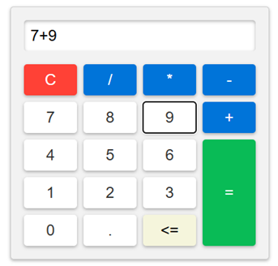

# Basic Calculator

A simple calculator built with vanilla HTML, CSS, and JavaScript. Supports basic arithmetic operations with a clean, responsive interface.

## Screenshot



## Features

- Addition, subtraction, multiplication, and division
- Decimal point support
- Backspace button to delete the last character
- Clear button to reset the display
- Keyboard-friendly button layout

## Technologies Used

- HTML5
- CSS3 (CSS Grid for layout)
- JavaScript (vanilla, no frameworks)

## Project Structure

```
basic-calculator/
├── index.html
├── style.css
└── index.js
```

## Getting Started

No installation or dependencies required. Just clone the repository and open `index.html` in your browser.

```bash
git clone https://github.com/RodriStar/basic-calculator.git
cd basic-calculator
open index.html
```

## Credits

This project was built by following a YouTube tutorial. The original source and structure were provided by the tutorial author — full credit goes to them for the design and logic approach.

**[HTML CSS JavaScript Projects | 20 HTML CSS JS Projects 2026](https://youtu.be/p5U77bZ0CEQ?t=2856)**


## License

This project is intended for educational and practice purposes.

Rodrigo Martínez I.